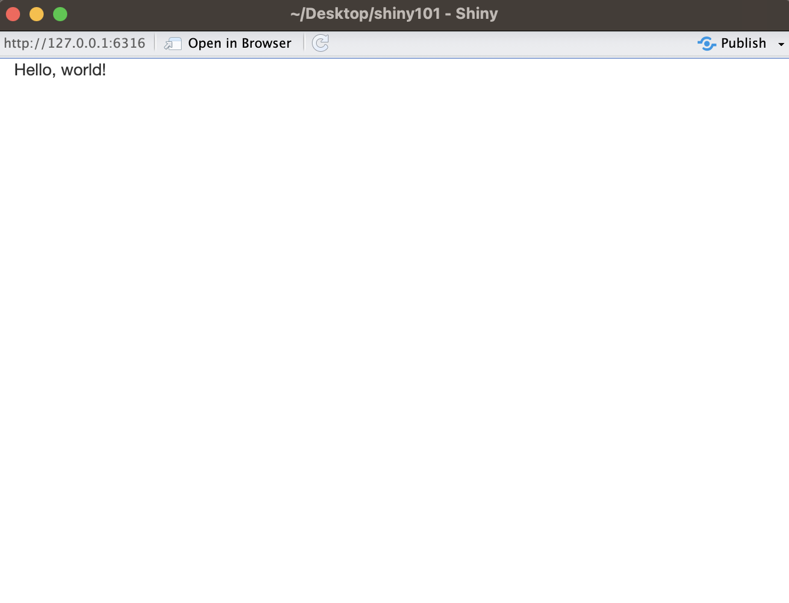
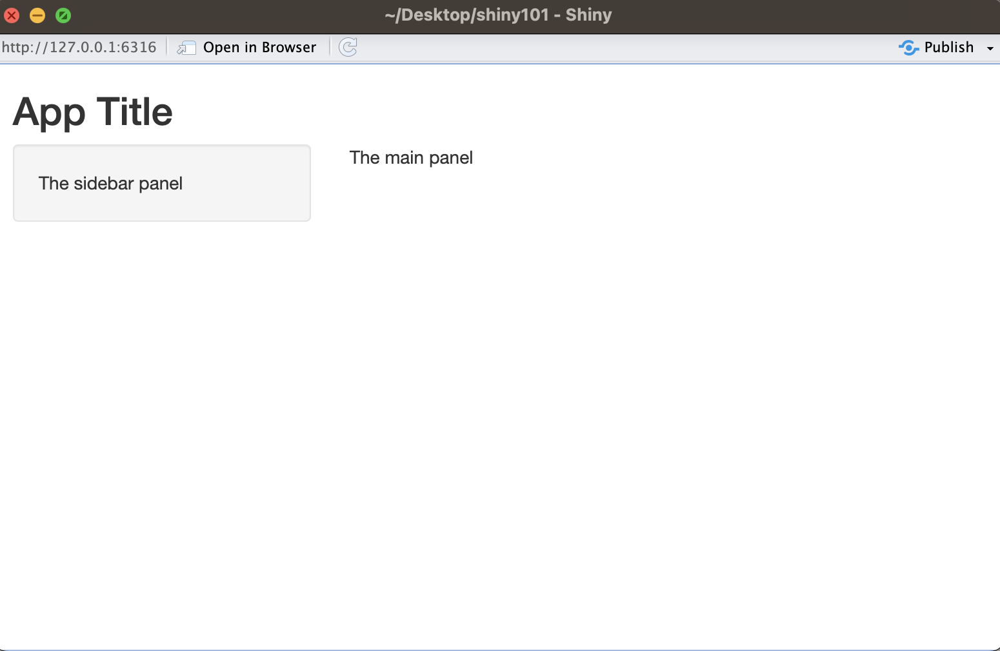

```{r setup, include=FALSE}
knitr::opts_chunk$set(echo = FALSE)
library(dplyr)
```

## About the Speaker

::: columns-2
{width="491"}

-   University of Zurich (M.SC. Informatics)
-   Came across R programming language in 2018
-   Joined R-Ladies Zurich in December 2022
-   Data Scientist at [cynkra GmbH](https://www.cynkra.com/)
-   First shiny app : [The sleepy app](https://drive.google.com/file/d/1KWCVkmNxDeOr36V7CBWDMgWKvtIV3qau/view)
:::

# Ice breaker Questions

## Agenda

-   Introduction to R shiny

-   Structure of a Shiny App

-   Creating Shiny files or Folder

-   Run and Stop A Shiny App

-   Code Along

    -   Your First Shiny App
    -   Shiny UI Layout
    -   Shiny HTML tags
    -   Adding Controls
    -   Adding Behaviour
    -   Mini Project
    -   Capstone Project

-   More on Shiny

-   Reference

## Introduction to R Shiny

-   R package for building interactive web applications

-   Seamlessly integrates R ecosystem

-   No HTML, CSS and Javascript skills required

-   Shiny uses a reactive programming model

-   Easy Deployment Options

-   To install and load Shiny package:

    ```{r,echo=TRUE, eval=FALSE}
    # Install shiny package
    install.packages("shiny")

    # Load shiny
    library(shiny)
    ```

## **Structure of a Shiny App --- Single-file App**

-   A single script (app.R)

    {style="margin-left: 200px;" width="135"}

-   Three major parts : The `ui objects`, the `server functions` and a call to `ShinyApp`

-   app.R

    ```{r eval=FALSE, echo=TRUE}
    # The definition of ui
    ui <- ...

    # The definition of server
    server <- ...

    # call to the app
    shinyApp(ui = ui, server = server)
    ```

## **Structure of a Shiny App --- Two-file app**

-   A two-file script on a directory

    {style="margin-left: 200px;" width="135"}

-   ui.R

    ```{r eval=FALSE, echo=TRUE}
    # The definition of ui
    ui <- ...
    ```

-   Server.R

    ```{r eval=FALSE, echo=TRUE}
    # The definition of server
    server <- ...
    ```

## Creating Shiny files or Folder

-   Manually: Create a directory and add file(s) *➝ `"app.R"`*`, "ui.R", "server.R"`
-   On Rstudio: Click `File` \> `New Project`, then choose `New Directory` and `Shiny Web Application`

## **Run and Stop A Shiny App**

-   To run a shiny app:

    -   Click on `Run App`, if you are using the Rstudio

    {width="440" height="20"}

    -   `runApp("app_directory")`
    -   `Cmd/Ctrl` + `Shift` + `Enter`

-   To stop a shiny app:

    -   Click the stop sign icon on the interface of the R console
    -   Click the console and then select `Esc`
    -   Close the app window for Shiny

## Code Along

Time to code along!

-   Download the files from here :

## First Shiny App

-   Find the required folder: `../shiny101/00_hello_world`

    ```{r eval=FALSE, echo=TRUE}
    library(shiny)
    ui <- fluidPage("Hello, world!")
    server <- function(input, output, session) {
      
    }
    shinyApp(ui = ui, server = server)
    ```

{style="margin-left:200px; padding:10px; border: solid 1px gray;" width="350"}

## Shiny UI Layout

-   Find the required folder: `../shiny101/01_shiny_ui_layout`

    ```{r, echo=TRUE, eval=FALSE}
    library(shiny)
    ui <- fluidPage(
      titlePanel("Title"),
      sidebarLayout(
    sidebarPanel("The sidebar panel"),
    mainPanel("The main panel")
      )
    )
    server <- function(input, output, session) {}
    shinyApp(ui = ui, server = server)
    ```

    {style="margin-left:200px; padding:10px; border: solid 1px gray;" width="293"}

## Shiny HTML tags

-   A Shiny app is a bunch of a html codes

-   Add content with one of Shiny's HTML tag function

-   Functions are parallel to HTML5 tags

-   Some Examples:

    -   header tags: *`h1(), h2(), h3(), h4(), h5(),  and h6()`*
    -   container tags: *`div(), span()`*
    -   Image tag: *`img()`*
    -   see more: <https://shiny.posit.co/r/articles/build/tag-glossary/>

    ```{r, echo=TRUE}
    shiny::tags %>%
      names() %>%
      head(20)
    ```

## Shiny app built with Shiny Html Tags

```{r, echo=FALSE}
library(shiny)

# Define UI ----
ui <- fluidPage(
  titlePanel("My Shiny App"),
  sidebarLayout(
    sidebarPanel(
      h2("Installation"),
      p("Shiny is available on CRAN, so you can install it in the usual way from your R console:"),
      code('install.packages("shiny")'),
      br(),
      br(),
      br(),
      br()
    ),
    mainPanel(
      h1("Introducing Shiny"),
      p(
        "Shiny is a new package from RStudio that makes it ",
        em("incredibly easy "),
        "to build interactive web applications with R."
      ),
      br(),
      p(
        "For an introduction and live examples, visit the ",
        a("Shiny homepage.",
          href = "https://shiny.posit.co"
        )
      ),
      br(),
      h2("Features"),
      p("- Build useful web applications with only a few lines of code—no JavaScript required."),
      p(
        "- Shiny applications are automatically 'live' in the same way that ",
        strong("spreadsheets"),
        " are live. Outputs change instantly as users modify inputs, without requiring a reload of the browser."
      ),
      br(),
      br(),
      br(),
      p(
        a("source: shiny posit",
          href = "https://shiny.posit.co/r/getstarted/shiny-basics/lesson2/",
          style = "font-size: 12px; color:lightgray; font-style: italic; float:right;"
        )
      )
    )
  )
)

# Server logic ----
server <- function(input, output) {}

tags$div(
  style = "border:solid 1px gray;",
  shinyApp(ui = ui, server = server, options = list(height = 300, width = 300))
)
```

## Adding Controls: Input Widgets

-   Widgets are web elements provided for users to interact with the app
-   Widgets collect and send users' input to the shiny engine

::: {style="color:lightgray; font-size: 6px; margin-left:250px;"}
*fig 1: Basic shiny control widgets*
:::

{style="margin-left:200px; padding:10px; border: solid 1px gray;" width="391" height="300"}

-   More at source: [*https://shiny.posit.co/r/gallery/widgets/widget-gallery/*](https://shiny.posit.co/r/gallery/widgets/widget-gallery/)

## Adding Controls : UI Output

-   Displays elements such as texts, tables, plots processed by `shiny server`
-   Usually works with values collected by the input widgets
-   Each output is a product of `render*()`
-   Common shiny output: `textOutput` , `verbatimTextOutput`, `tableOutput` e.t.c

## UI controls: Sample

-   selectInput(inputId = "input_id", label = "Widget Label", ... )

-   Arguments `inputId` and `label` are regular to all input widgets

-   tableOutput(outputId = "output_id")

-   `../shiny101/03_adding_controls`

    ```{r, echo=TRUE, warning=FALSE}
    ui <- fluidPage(
      sidebarLayout(
    sidebarPanel(
      selectInput("input_data",
        label = "Choose a data:",
        choices = ls(package:datasets)
      )
    ),
    mainPanel(
      h4("VerbatimTextOutput here:"),
      verbatimTextOutput("display_summary"),
      h4("tableOutput below:"),
      tableOutput("display_table")
    )
      )
    )
    ```

    ## The App without Output elements on display

    ```{r}
    server <- function(input, output) {}
    shinyApp(ui = ui, server = server, options = list(height = 200))
    ```

## Adding Behaviour

-   Shiny uses reactive programming to create interactivity e.g., `observeEvent()`, `reactive()`

-   Informs shiny server how to process information received from the UI `(NB: Informs not order)`

-   Uses render function family such as `renderTable()`

-   `../shiny101/04_adding_behaviour`

    ```{r, warning=FALSE}
    ui <- fluidPage(
      sidebarLayout(
    sidebarPanel(
      selectInput("input_data",
        label = "Choose a data:",
        choices = ls(package:datasets)
      )
    ),
    mainPanel(
      h4("VerbatimTextOutput here:"),
      verbatimTextOutput("display_summary"),
      h4("tableOutput below:"),
      tableOutput("display_table")
    )
      )
    )
    ```

    ```{r, echo=TRUE}
    server <- function(input, output, session) {
      output$display_summary <- renderPrint({
    data <- get(input$input_data, "package:datasets")
    summary(data)
      })

      output$display_table <- renderTable({
    data <- get(input$input_data, "package:datasets")
    data
      })
    }
    ```

## Result

```{r}
shinyApp(ui = ui, server = server, options = list(height = 200))
```

## Mini Project

-   Build your first "Survey App"!

-   `../shiny101/05_mini_project`

## Capstone Project

-   Let's build a "Data Exploration App"!
-   `../shiny101/06_capstone_project`

## More on Shiny

-   Enhancing your app
    -   Build your with HTML and customize appearance with CSS
    -   Enhance interactivity and feedback --- `{shinyjs}, {shinyFeedback}, {shinycssloaders}`
-   Deployment: `shiny.io, Posit Connect, Heroku, Azure, Google Cloud Platform (GCP)` et.c.
-   Improve performance: consider separating logic, shiny module e.t.c.
-   Tests: `{testthat}, {shinytest2}`
-   Learn more about Shiny:
    -   [Shiny Cheat Sheet](https://shiny.posit.co/r/articles/start/cheatsheet/)
    -   [Tutorials on YouTube and Demos from Posit](https://www.youtube.com/playlist?list=PL9HYL-VRX0oTOK4cpbCbRk15K2roEgzVW)
    -   [Hadley Wickham's book, Mastering Shiny](https://mastering-shiny.org/index.html)
    -   [Shiny for R's Get Started Tutorials](https://shiny.posit.co/r/getstarted/shiny-basics/lesson1/index.html)

## Reference

1.  <https://shiny.posit.co/r/getstarted/shiny-basics/>
2.  <https://mastering-shiny.org/index.html>

# Questions?

## Rstudio Tip

-   Add shiny app boilerplate by typing \"shinyapp\" and pressing `Enter/return` or `Shift+Tab`.

-   Add a function boilerpater by typing "fun" and pressing `Enter/return` or `Shift+Tab`.
